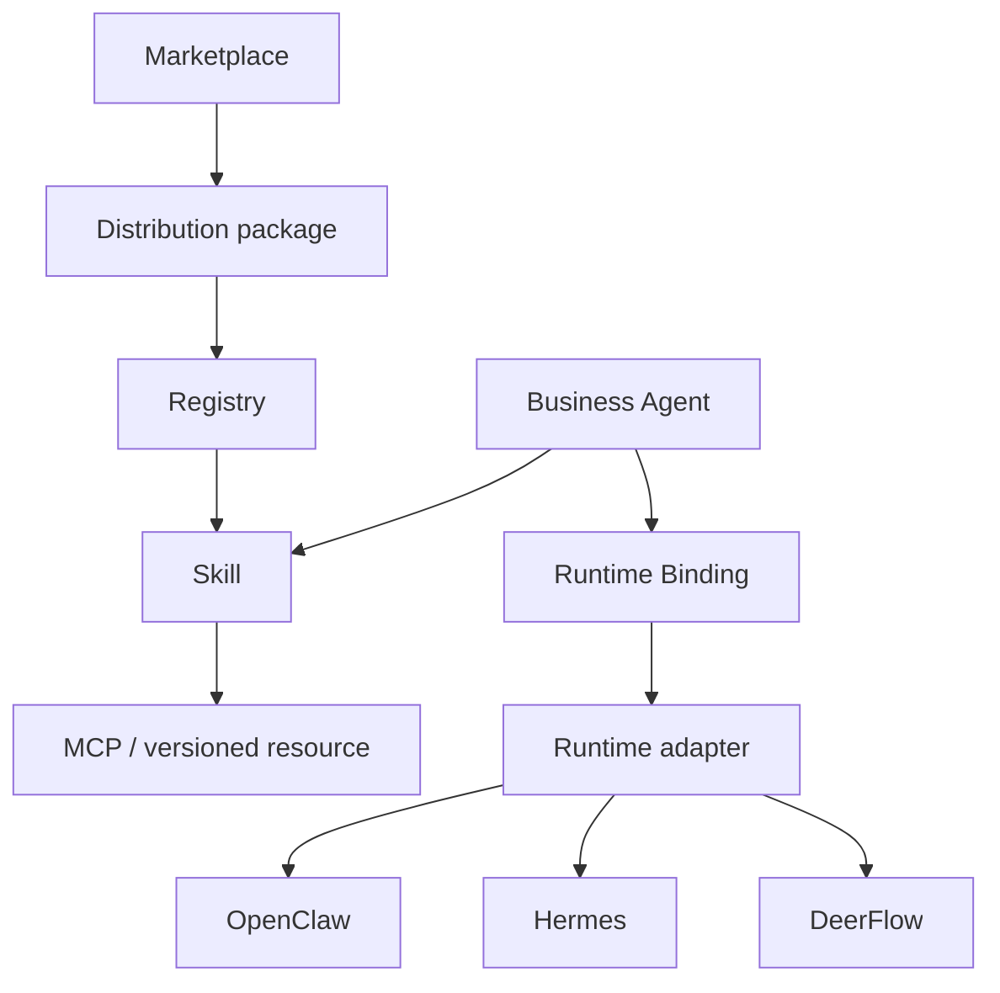

# AI Agent Control Plane 設計

## 1. Positioning

> **Production Control Plane for AI Agents**
> **Define Business Agents once. Execute them anywhere.**

Control Plane は Agent の業務定義を Runtime 実装から分離し、同じ Business Agent を OpenClaw、
Hermes、DeerFlow、将来の Runtime へ明示 Binding で配置する。Runtime の自動切替は行わず、
どの定義をどこで実行したかを常に監査できることを優先する。



## 2. Domain contracts

### Business Agent

`AgentProfile` の正式な編集対象は `name / description / instructions / skill_ids / enabled`。
Plugin、MCP、Tool、Runtime、command policy を Agent に埋め込まない。`tool_names` と
`command_allowed_prefixes` は移行リリースの読取互換だけである。

### Skill

Skill は AgentSkills 互換の指示本体であり、次の内部依存を持つ。

```json
{
  "id": "business_rag_research",
  "instructions": "...",
  "mcp_requirements": [
    {"server_id": "control-plane", "tool_names": ["external_rag_search"]}
  ],
  "resource_ids": []
}
```

Binding 同期は選択 Skill の和集合だけを materialize する。Runtime prompt への列挙だけで権限を
表現せず、Skill allowlist と Binding MCP tool allowlist を実体として生成する。

### Marketplace package

正式 manifest は `skills[] / mcp_servers[] / resources[]`。resource kind は `prompt / workflow /
template` で、初期実装は inline JSON/text のみ。resource を実行しない。

Install は事前に Skill/MCP/resource の重複と参照を検証し、衝突時に package 全体を拒否する。
旧 `agents[]` は Agent を作らず template resource に変換して warning を返す。参照中 Skill を持つ
package の disable/uninstall は `409`。

### RuntimeDefinition

Runtime は kind、接続先、secret env ref、managed service、capabilities、状態を持つ。secret 値は
永続化しない。`legacy-native` は built-in read-only RuntimeDefinition として既存 Run に付与する。

### RuntimeBinding

Binding は `agent_id / runtime_id / native_agent_ref / is_default / enabled / policy / sync_status` を
持つ。Agent ごとの既定は最大1件。同一 Runtime の `native_agent_ref` も一意。Agent 削除時は
Binding と materialization を削除する。

### RunState

共通 Run は従来の状態/Event/Artifact/Audit に次を追加する。

- `runtime_id`
- `binding_id`
- `external_run_id`
- `external_cursor`
- submit 時点の `runtime_capabilities`

`POST /api/runs` は明示 Binding、Agent 既定 Binding の順に解決する。未 Binding、同期未完、
Runtime disabled は `409`。外部 submit 後も Binding と capability snapshot は変えない。

## 3. Adapter boundary

```python
class RuntimeAdapter(Protocol):
    probe_capabilities(...)
    sync_binding(...)
    submit_run(...)
    follow_events(...)
    get_status(...)
    cancel(...)
    list_artifacts(...)
```

- OpenClaw: Gateway WebSocket protocol v3–4、`chat.send`、`agent.wait`、`sessions.abort`、
  `artifacts.list`。内部 control-plane client として最小 scope で handshake する。
- Hermes: `/v1/capabilities`、`/v1/runs`、SSE events、status、stop。
- DeerFlow: `/api/langgraph/threads` と run/state、thread state の artifacts。

Runtime が対応しない操作はローカル成功に置き換えず、
`409 runtime_capability_unsupported` を返し UI に理由を表示する。

## 4. Binding MCP

`/api/mcp/{binding_id}` は MCP initialize / tools/list / tools/call の最小 surface を提供する。
公開 tool は Agent の選択 Skill が要求する `server_id=control-plane` の閉包だけ。tool 実行は既存の
Pydantic input schema、ToolPolicy、PII/secret masking、audit metadata を再利用する。

認証 token は次の順で解決する。

1. `CONTROL_PLANE_MCP_TOKEN_<NORMALIZED_BINDING_ID>`
2. `AGENT_CONTROL_PLANE_MCP_TOKEN_SECRET` から HMAC-SHA256 派生

token が無い場合は fail closed (`503`)。値を Binding JSON、snapshot、API に保存しない。

## 5. Dispatcher and persistence

開発時は FastAPI BackgroundTasks で submit する。本番は `runtime-dispatcher` が Oracle checkpoint
row を `SELECT ... FOR UPDATE` し、queued Run に期限付き lease を付けて claim する。submit 成功または
失敗時に lease を除去して Event を保存する。これにより別 queue 製品を追加しない。

外部 dispatcher は `AGENT_RUNTIME_REPOSITORY_BACKEND=oracle_checkpoint|oracle_normalized` が前提。
memory backend は process 間共有されないため production dispatcher に使用しない。

## 6. Docker services

`docker-compose.yml` は Control Plane と次の opt-in profile を持つ。

| Profile | Service | State | Health |
|---|---|---|---|
| `dispatcher` | `runtime-dispatcher` | Oracle + control-plane volume | process |
| `openclaw` | `runtime-openclaw` | `openclaw-state/auth` | `/readyz` |
| `hermes` | `runtime-hermes` | `hermes-state` | `/health` |
| `deerflow` | `runtime-deerflow` | `deerflow-state` | `/api/models` |

Runtime image はすべて公式 registry の multi-arch digest を固定する。Docker socket は mount しない。
管理 API は `AGENT_RUNTIME_SERVICE_CONTROL_ENABLED=true` の管理者 host 運用でのみ有効。

## 7. Snapshot migration

Snapshot v2 は runs/agents/legacy memory に `control_plane_state.runtimes/bindings` を追加する。

- v1 tool を一意に対応できる Skill へ推定。
- 変換不能 tool があれば `migration_required=true`, `enabled=false`。
- command prefix は最初の Binding 作成時に `policy.command_allowed_prefixes` へ移す。
- 既存 Run は model default により `runtime_id=legacy-native`。
- Memory は export/search だけを維持し、手動新規書込は `410`。
- v1 Run は `X-Agent-API-Version: 1` 明示時のみ。deprecation/sunset header を返す。

## 8. UI information architecture

主要ナビは「業務 Agent / Skill / Runtime / Run / 承認・監査 / Marketplace」。Agent 画面では Skill
だけを選び、Agent 詳細の「実行先」panel で Binding を追加・同期する。Run は Agent と Binding 上書き
だけを受け取り、Tool/arguments は表示しない。

Runtime 画面は status、capabilities、enable、probe、管理可能な service action/log を表示する。
未 Binding、sync error、degraded、capability 非対応を warning/error state として表示する。

## 9. Non-goals

- Control Plane 内の新しい Agent Runtime / planner / workflow engine
- Runtime 自動 failover
- 外部 archive の Marketplace install
- OKE / Container Instances driver（Compose 成立後に追加）
- 別 LLM provider、外部 vector DB、新規 queue product
