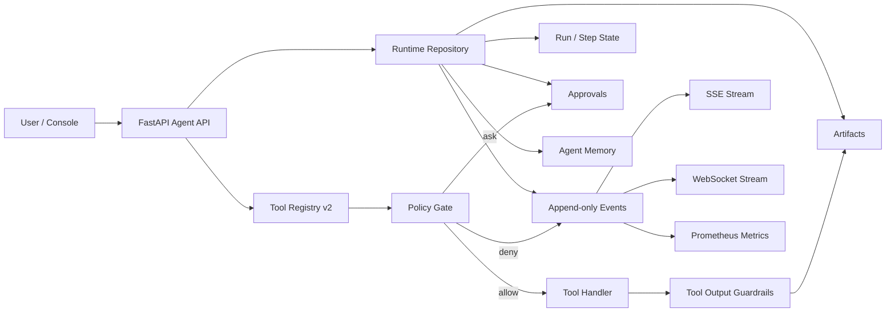
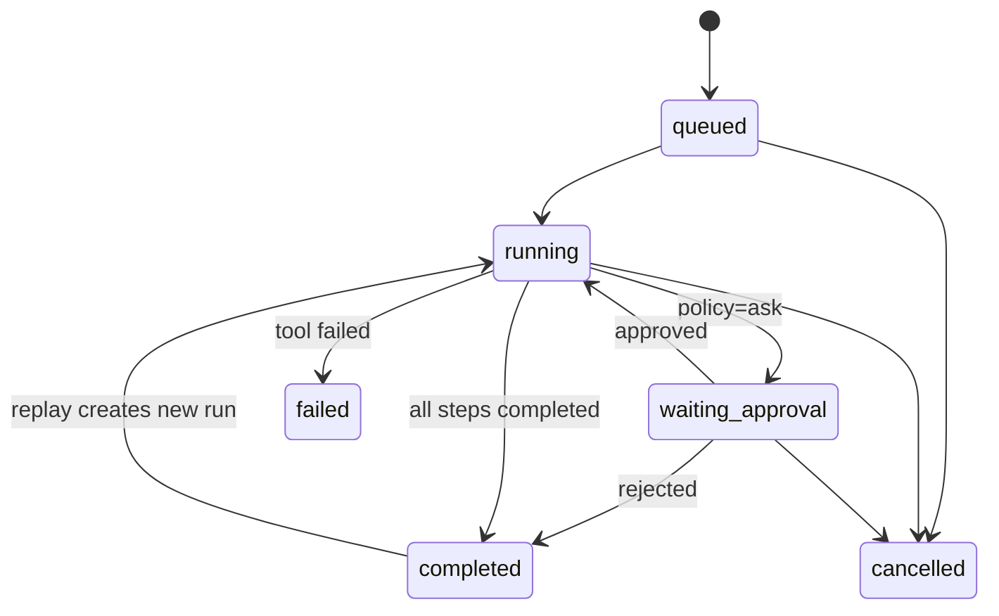
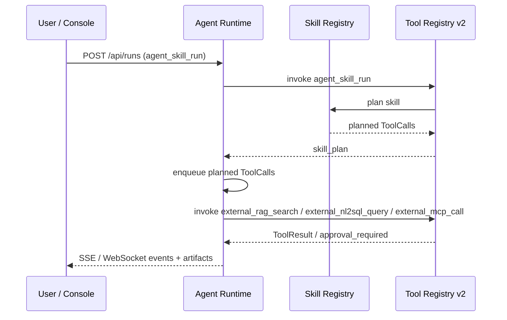

# Agent Runtime Design

最終更新: 2026-06-21

本ドキュメントは、このリポジトリを「業務 Agent そのものを安全に実行・監査・表示する Runtime / Console」として実装するための正本です。業務 RAG と業務 NL2SQL は外部能力として接続し、本プロジェクトは orchestration、permission、audit、context、UI を担当します。

## 1. 外部公開情報から採用した設計原則

漏洩版・非公開コードは参照しません。以下の公開情報から、実装ではなく設計原則だけを本プロジェクトの OCI / Oracle / FastAPI / React スタックへ再マッピングします。

| Source | 採用する原則 | 本プロジェクトでの実装 |
|---|---|---|
| [OpenAI Agents SDK](https://openai.github.io/openai-agents-python/) | 少数の primitive、tool schema、guardrails、human-in-the-loop、sessions、tracing | `Run` / `Step` / `ToolCall` / `ToolResult` / `ApprovalRequest` / `MemoryEntry` と Tool Registry v2 |
| [OpenAI Agents SDK Guardrails](https://openai.github.io/openai-agents-python/guardrails/) | input / output / tool 境界で validation と tripwire を置く | tool output guardrail、sensitive value masking、non-read-only SQL warning |
| [Claude Code official overview](https://code.claude.com/docs/en/overview) | codebase / files / commands / external tools を横断する agent は permission と tool integration が核 | allow / ask / deny policy、approval UI、external tool adapters |
| [Claude Code hooks reference](https://code.claude.com/docs/en/hooks) | deterministic extension points を runtime 境界に置く | 今後の hook 拡張は event log と tool policy に接続する |
| [LangGraph overview](https://docs.langchain.com/oss/python/langgraph/overview) | long-running stateful agents には durable execution、streaming、human-in-the-loop、persistence が必要 | append-only event log、SSE、pause / resume / replay、snapshot |
| [LangGraph persistence](https://docs.langchain.com/oss/python/langgraph/persistence) | short-term thread state と long-term store を分ける | Run state と Memory store を分離 |
| [Google ADK](https://adk.dev/) | graph workflow、runtime、resume/cancel、artifacts、observability、context management | Run lifecycle、artifact model、runtime safety settings、metrics |
| [Microsoft AutoGen](https://microsoft.github.io/autogen/stable/index.html) | event-driven multi-agent core、external extensions、container/sandbox execution | 現段階は single-runtime + external adapters。将来 sandbox tool を追加する場合も policy gate 必須 |
| [AutoGen human-in-the-loop](https://microsoft.github.io/autogen/stable/user-guide/agentchat-user-guide/tutorial/human-in-the-loop.html) | run 中の同期承認と、永続化後に次 run で feedback を与える方式を分ける | approval で run を `waiting_approval` に止め、decision 後に残 step を継続 |
| [MCP](https://modelcontextprotocol.io/docs/getting-started/intro) | 外部 data / tools / workflow を標準化された境界で接続する | 第一版は REST canonical contract。MCP は Tool Registry v2 の adapter として後続追加 |

## 2. 境界と責務

本プロジェクトが担当するもの:

- Agent run の lifecycle 管理。
- Tool schema、permission、timeout、retry、audit metadata。
- Approval gate と operator UI。
- SSE event streaming、artifact 表示、audit 表示。
- Agent 内部の memory / retrieval。用途は run summary、tool learning、user preference、operator note。
- 外部 RAG / NL2SQL の REST adapter。
- Prompt injection / sensitive data / SQL audit guardrails。

本プロジェクトが担当しないもの:

- 業務 knowledge base の indexing。
- 業務 DB への接続、credential 保存、SQL 実行。
- NL2SQL model、SQL validator、SQL executor。
- 外部 vector DB。
- AGENTS.md の確定スタックから外れる LLM provider。

## 3. Runtime model



主要 object:

- `Run`: ユーザー goal、agent、status、steps、events、approvals、artifacts、pending tool calls。
- `Step`: tool 実行単位。`pending`、`running`、`waiting_approval`、`completed`、`failed`、`cancelled`。
- `Event`: append-only。SSE / WebSocket と metrics の入力。
- `ToolCall`: tool name、arguments、trace_id。
- `ToolResult`: success / error / policy / guardrail / audit metadata。
- `ApprovalRequest`: pending approval と decision。
- `Artifact`: RAG evidence、structured table、その他 tool result。
- `MemoryEntry`: run summary、tool learning、user preference、note。

WebSocket stream (`/api/runs/{id}/events/ws`):

- Run event は `{ "type": "<event_type>", "event": ... }`。
- Server heartbeat は `{ "type": "heartbeat", "run_id": "...", "run_status": "...", "server_time": "..." }`。
- Client command は `ping` / `cancel` / `resume` / `approval_decision` を受け付け、`command_id` があれば応答へ透過します。
- Command success は `{ "type": "command.accepted", "ok": true, "command": "...", "command_id": "...", "duplicate": false }`。
- Command error は従来互換の `{ "type": "error", "error_code": "...", "message": "..." }` に加え、`ok=false`、`command`、`command_id` を含めます。
- Frontend は最後に受信した `event.id` を保持し、切断後は `after_event_id` 付きで再接続して gap を抑制します。
- 同一 Run 内で同じ `command_id` が再送された場合は副作用を再実行せず、`duplicate=true` の ACK を返します。
- Server は `max_events_per_tick` で event 送信を小分けにし、backlog がある場合も heartbeat / command 処理を挟みます。

## 4. Run lifecycle



Rules:

- read-only かつ side-effect なしの tool は既定で allow。
- `write` / `sensitive` / side-effect tool は既定で ask。
- deny policy は approval を作らず失敗扱い。
- cancel は pending approval を `cancelled` にする。
- late approval は run を再開しない。
- replay は元 run の tool calls と metadata をコピーした新 run を作る。

## 5. Snapshot import / export

Runtime state は `AgentRuntimeSnapshot` として export / import できます。用途は backup、test fixture、環境移行、障害復旧の初期段階です。

Endpoints:

- `GET /api/runtime/snapshot`: 現在の `runs`、`agents`、`memory` を export。
- `POST /api/runtime/snapshot/import`: snapshot を dry-run 検証、または明示確認付きで置換。

Import request:

```json
{
  "snapshot": {},
  "dry_run": true,
  "confirm_replace": false,
  "reason": "migration validation"
}
```

Rules:

- `dry_run=true` は状態を変更せず、summary / errors / warnings を返す。
- `dry_run=false` は `confirm_replace=true` が必須。
- 不正 snapshot は置換しない。
- import 時は approval index と default agent を repository 内で再構築する。
- validation は snapshot version、重複 ID、unknown tool、run/step/approval/event の帰属、終端 run の pending approval などを検査する。

## 6. Runtime persistence

Repository backend は環境変数で切り替えます。

- `AGENT_RUNTIME_REPOSITORY_BACKEND=memory`: 既定。プロセス内のみ。
- `AGENT_RUNTIME_REPOSITORY_BACKEND=file`: `AGENT_RUNTIME_SNAPSHOT_PATH` へ JSON checkpoint を保存。
- `AGENT_RUNTIME_REPOSITORY_BACKEND=oracle_checkpoint`: Oracle CLOB checkpoint を保存。
- `AGENT_RUNTIME_REPOSITORY_BACKEND=oracle_normalized`: Oracle CLOB checkpoint と normalized projection tables を保存。

Oracle mode:

- `AGENT_RUNTIME_ORACLE_DSN`
- `AGENT_RUNTIME_ORACLE_USER`
- `AGENT_RUNTIME_ORACLE_PASSWORD`
- `AGENT_RUNTIME_ORACLE_TABLE=AGENT_RUNTIME_CHECKPOINTS`
- `AGENT_RUNTIME_ORACLE_CHECKPOINT_KEY=default`
- `AGENT_RUNTIME_ORACLE_CREATE_SCHEMA=true`
- `AGENT_RUNTIME_ORACLE_PROJECTION_PREFIX=AGENT_RUNTIME`
- `AGENT_RUNTIME_ORACLE_PROJECTION_RETENTION_DAYS=0`
- `AGENT_RUNTIME_ORACLE_PROJECTION_WRITE_MODE=replace` (`replace` / `incremental`)

第一段階では既存の状態機械を維持したまま checkpoint を Oracle に保存し、再起動時に
`AgentRuntimeSnapshot` を復元します。`oracle_normalized` は同じ transaction で
`AGENT_RUNTIME_RUNS`、`AGENT_RUNTIME_EVENTS`、`AGENT_RUNTIME_STEPS`、
`AGENT_RUNTIME_APPROVALS`、`AGENT_RUNTIME_ARTIFACTS`、`AGENT_RUNTIME_MEMORY` へ
現在 snapshot を projection します。Run 横断の tool call audit は `oracle_normalized` では
projection table から読み出し、run/tool/status/approval filter、Business View、error_code、
guardrail warning、offset/limit は SQL の `COUNT(*)` + `JSON_VALUE` / `JSON_EXISTS` +
`OFFSET/FETCH` に下推しします。`replace` mode は既存互換の全量 projection 再作成、
`incremental` mode は projection rows を `MERGE` で upsert し、event rows を append-only
ID 単位で維持します。`AGENT_RUNTIME_ORACLE_PROJECTION_RETENTION_DAYS > 0` の場合は
normalized projection tables のみ retention を適用し、checkpoint snapshot は復旧性のため保持します。
production review 用の versioned DDL artifact は
`backend/sql/agent_runtime_oracle_normalized_v1.sql` に置き、runtime auto-create と同じ table set、
audit query 用索引、JSON_VALUE(error_code) function-based index、任意の range partition template を
記録します。runtime auto-create は既存互換の非 partition table + indexes を作り、partition table 化は
DBA 管理の migration で適用します。
実 Oracle 負荷検証は `backend/scripts/agent_runtime_oracle_load_check.py` を使います。`--dry-run` は
Oracle 接続なしで設定解決だけを確認し、Oracle env が揃っている場合は指定件数の echo run を作成して
projection-backed audit query の件数と所要時間を JSON で出力します。`--audit-iterations` と
`--audit-limit` で audit query を複数回測定し、write / audit の p50 / p95 / max を出力します。
`--sla-write-ms` と `--sla-audit-p95-ms` を指定した場合、超過時は `ok=false`、`violations[]`、exit code
`3` で CI / DBA 検証を fail できます。

Production partition migration 手順:

1. DBA が `backend/sql/agent_runtime_oracle_normalized_v1.sql` を基準に、環境別 prefix と tablespace を確定する。
2. 既存 auto-create table を使っている環境では、maintenance window 中に application write を停止する。
3. partition table を別名で作成し、既存 projection rows を `INSERT /*+ APPEND */ ... SELECT ...` で移行する。
4. 索引を作成し、`AGENT_RUNTIME_STEPS_ERROR_CODE_IX` の function-based index と audit query plan を確認する。
5. table rename / synonym 切替後、`AGENT_RUNTIME_REPOSITORY_BACKEND=oracle_normalized`、
   `AGENT_RUNTIME_ORACLE_PROJECTION_WRITE_MODE=incremental` で application を起動する。
6. `uv run python scripts/agent_runtime_oracle_load_check.py --runs 1000 --audit-iterations 20 --audit-limit 100`
   を実行し、JSON 結果を release 記録に添付する。必要なら `--sla-write-ms` / `--sla-audit-p95-ms` を CI gate
   にする。
7. retention を使う場合は `AGENT_RUNTIME_ORACLE_PROJECTION_RETENTION_DAYS` を段階的に有効化し、
   partition drop / delete policy は DBA 管理 job と重複しないように片方へ寄せる。

## 7. Runtime RBAC

RBAC は runtime guard として実装します。既定は `AGENT_RBAC_ENABLED=false` で、既存のローカル開発
と e2e を壊しません。`true` の場合、前段の認証基盤が付与した header を読みます。

- Actor header: `AGENT_RBAC_ACTOR_HEADER=x-agent-actor`
- Roles header: `AGENT_RBAC_ROLES_HEADER=x-agent-roles`
- Business Views header: `AGENT_RBAC_BUSINESS_VIEWS_HEADER=x-agent-business-views`
- Static actor policy: `AGENT_RBAC_ACTOR_POLICIES_JSON`
- Signed identity header: `AGENT_RBAC_IDENTITY_HEADER=x-agent-identity`
- Signed identity HMAC secret: `AGENT_RBAC_IDENTITY_HMAC_SECRET`
- External policy service: `AGENT_RBAC_POLICY_URL`
- External policy service API key: `AGENT_RBAC_POLICY_API_KEY`
- External policy timeout/cache: `AGENT_RBAC_POLICY_TIMEOUT_SECONDS=2`、`AGENT_RBAC_POLICY_CACHE_SECONDS=60`
- JWT bearer: `AGENT_RBAC_JWT_BEARER_ENABLED=false`
- JWT HS256 secret: `AGENT_RBAC_JWT_HS256_SECRET`
- JWT JWKS URL/cache: `AGENT_RBAC_JWT_JWKS_URL`、`AGENT_RBAC_JWT_JWKS_CACHE_SECONDS=300`
- JWT issuer/audience: `AGENT_RBAC_JWT_ISSUER`、`AGENT_RBAC_JWT_AUDIENCE`
- JWT claim mapping: `AGENT_RBAC_JWT_ROLES_CLAIM=roles`、
  `AGENT_RBAC_JWT_BUSINESS_VIEWS_CLAIM=business_view_ids`、`AGENT_RBAC_JWT_AGENT_IDS_CLAIM=agent_ids`
- Roles: `operator`、`approver`、`auditor`、`admin`
- `admin` は全高リスク API にアクセス可能。

Protected operations:

- `operator`: run 作成 / cancel / resume / replay、単発 tool invoke、memory 追加。
- `approver`: approval decision。
- `auditor`: run audit、global audit、CSV export。
- `admin`: settings patch、agent create/patch、snapshot export/import。

この段階は identity provider ではなく、API gateway / reverse proxy / auth service 後段の enforcement
layer です。`business_view_id` は run metadata または tool arguments から解決し、
`X-Agent-Business-Views` に含まれない view の run 作成 / 読取 / audit / control を拒否します。
`AGENT_RBAC_ACTOR_POLICIES_JSON` が設定されている場合、`X-Agent-Actor` をキーに
`roles`、`business_view_ids`、`agent_ids` を解決し、header roles / business views より優先します。
未登録 actor は従来どおり header fallback を使います。

`AGENT_RBAC_IDENTITY_HMAC_SECRET` が設定されている場合は signed identity mode になり、
raw role / business view header と static actor policy fallback を無効化します。identity header は
`<base64url JSON>.<hex HMAC-SHA256>` 形式で、署名入力は base64url payload 文字列です。
payload は `actor` または `sub`、`roles`、`business_view_ids`、`agent_ids`、任意の `exp` / `nbf`
を持てます。署名不一致、期限切れ、未署名 request は権限なしとして扱い、run / audit / settings
の guard を bypass できません。

`AGENT_RBAC_POLICY_URL` が設定されている場合は external policy mode になり、raw role / business view
header fallback を無効化します。Agent Runtime は `{"actor": "...", "claims": {...}}` を policy service
へ POST し、`roles`、`business_view_ids`、`agent_ids` を受け取ります。policy service 未達、未登録 actor、
schema 不正は fail closed として権限なし扱いにします。signed identity と併用する場合、actor は signed
claims の `actor` / `sub` から解決します。

`AGENT_RBAC_JWT_BEARER_ENABLED=true` の場合は `Authorization: Bearer <JWT>` を標準 identity
source として扱い、raw header fallback を無効化します。HS256 は `AGENT_RBAC_JWT_HS256_SECRET`、
RS256 は `AGENT_RBAC_JWT_JWKS_URL` の JWKS で検証します。`iss` / `aud` / `exp` / `nbf` と
claim mapping から roles / business views / agent ids を解決します。RS256 検証は optional
`cryptography` が利用可能な環境で有効になり、利用不可時は fail closed します。

Static actor policy 例:

```json
{
  "alice": {
    "roles": ["operator", "viewer", "auditor"],
    "business_view_ids": ["sales-view"],
    "agent_ids": ["default"]
  },
  "admin": {
    "roles": ["admin"],
    "business_view_ids": ["*"],
    "agent_ids": ["*"]
  }
}
```

gateway / JWKS / external policy service の実環境検証は
`backend/scripts/agent_runtime_gateway_jwks_check.py` を使います。`--dry-run` は設定解決だけを出力し、
live mode は JWKS fetch、policy service probe、必要に応じて `AGENT_RBAC_JWT_SAMPLE_TOKEN` による
backend run 作成を JSON summary で確認します。`--rotation-check` は JWKS を 2 回 fetch して `kid` の追加 /
削除を比較し、`--min-rotated-kids` を満たさない場合は `ok=false`、exit code `3` にします。
`--rotation-interval-seconds` で IdP の rotation window に合わせた待機時間を指定できます。

## 8. Tool Registry v2

全 tool は以下を宣言します。

```json
{
  "name": "external_nl2sql_query",
  "description": "...",
  "input_schema": {},
  "output_schema": {},
  "permission_level": "sensitive",
  "side_effects": false,
  "timeout_seconds": 15,
  "max_retries": 3,
  "audit_tags": ["external", "nl2sql", "structured-data", "audit-sql"]
}
```

Policy 解決順:

1. `deny` に tool name があれば `deny`。
2. `ask` に tool name があれば `ask`。
3. `allow` に tool name があれば `allow`。
4. read-only かつ side-effect なしなら `allow`。
5. default mode が `deny` なら `deny`。
6. それ以外は `ask`。

### Auto Planner Loop v1

`POST /api/runs` で `tool_calls` が空、かつ `planner_mode=auto` の場合、Runtime は run 作成前に
goal / metadata を `PlannerDecision` へ変換します。Planner provider は `heuristic`、`oci_responses`、
`oci_agent` を選択できます。第一優先の `oci_responses` は OCI OpenAI-compatible Responses API
`/responses` へ HTTP JSON で問い合わせ、応答を同じ `PlannerDecision` 契約へ正規化します。
`oci_agent` は OCI Generative AI Agents 実践用の予約インターフェースで、現時点では既定で heuristic planner
へ fallback します。OCI Generative AI chat API や外部 LLM provider は使いません。
初期計画後も、各 tool step が成功し pending tool が空になったタイミングで `phase=continue` の planner を
再度呼び、次の Skill / ToolCall が必要かを判断します。これにより、最初の plan が RAG のみでも、RAG 結果後に
NL2SQL が必要と判断した場合は同じ Run 内で次 step を追加できます。

Planning result:

- RAG / 文書 / 根拠 / 引用系の goal: `agent_skill_run(business_rag_research)`。
- NL2SQL / SQL / 表 / 集計 / 指標系の goal: `agent_skill_run(structured_data_query)`。
- RAG と構造化データの両方を含む goal: `agent_skill_run(rag_then_structured_data)`。
- MCP tool name が metadata にある場合: `agent_skill_run(mcp_tool_call)`。
- MCP / tool のみ言及して具体 tool name が無い場合: `agent_skill_run(mcp_tool_discovery)`。
- command は危険度が高いため、自然文だけでは実行計画を作らず、`metadata.command` が明示された場合のみ
  `agent_skill_run(workspace_command)` を生成します。

Planner が ToolCall を生成した場合、Run event に `planner.completed` を記録します。その後の `agent_skill_run`
は Skill Registry でさらに標準 ToolCall へ展開され、通常の step / approval / artifact / audit を通ります。
明示的な `tool_calls` がある場合は初期 planner を走らせず、従来どおり指定された tool sequence から開始します。
ただし、明示 tool sequence が完了して pending tool が空になった後は continuation planner が必要な次 step を
追加できます。自動計画を完全に止めたい場合は `planner_mode=off` を指定します。

Continuation planner へ渡す context は tool output の原文ではなく、以下のような実行摘要だけです。

- completed tool names
- last tool name / success
- artifact kinds
- guardrail warnings
- current tool call count

Runtime は planner が同一 ToolCall を繰り返し返した場合、canonical signature で重複を抑止し、
`planner.duplicate_tool_call_suppressed` warning を event に残します。Continuation で Agent allowlist 外の tool、
未知 skill、上限超過が返った場合は run を壊さず、その continuation だけを拒否して run を完了方向へ進めます。

OCI Responses planner settings:

- `AGENT_PLANNER_PROVIDER=heuristic` (`heuristic` / `oci_responses` / `oci_agent`)
- `AGENT_PLANNER_OCI_RESPONSES_BASE_URL=https://inference.generativeai.${region}.oci.oraclecloud.com/openai/v1`
- `AGENT_PLANNER_OCI_RESPONSES_API_KEY`
- `AGENT_PLANNER_OCI_RESPONSES_MODEL`
- `AGENT_PLANNER_OCI_RESPONSES_PROJECT`
- `AGENT_PLANNER_OCI_AGENT_ENDPOINT`
- `AGENT_PLANNER_OCI_AGENT_API_KEY`
- `AGENT_PLANNER_TIMEOUT_SECONDS=8`
- `AGENT_PLANNER_MAX_RETRIES=3`
- `AGENT_PLANNER_FALLBACK_TO_HEURISTIC=true`
- `AGENT_PLANNER_ALLOWED_TOOL_NAMES=agent_skill_run`
- `AGENT_PLANNER_ALLOW_COMMAND_GENERATION=false`

Runtime settings API:

- `GET /api/settings/planner`: provider、OCI Responses / OCI Agent の configured 状態、timeout、retry、fallback、allowlist を返す。
- `PATCH /api/settings/planner`: secret 以外の planner runtime override を更新する。

OCI Responses request は secret-like metadata key を `***MASKED***` にしてから送信します。既定の
`AGENT_PLANNER_ALLOWED_TOOL_NAMES=agent_skill_run` では、Responses planner は直接 `external_nl2sql_query` や
`sandbox_command_run` を返せません。必ず `agent_skill_run` を返し、Skill 展開後に Agent の tool allowlist と
Tool Registry policy gate を通ります。`workspace_command` は危険度が高いため、既定では planner が自然文
だけから command を生成することを許可しません。必要な環境だけ `AGENT_PLANNER_ALLOW_COMMAND_GENERATION=true` と
command policy / approval を併用します。

OCI Responses planner output contract:

```json
{
  "selected_skill_id": "structured_data_query",
  "arguments": {
    "business_view_id": "sales",
    "mode": "execute",
    "limit": 100
  },
  "reason": "structured metrics requested",
  "confidence": 0.91,
  "warnings": [],
  "metadata": {"model": "cohere.command-a-03-2025"}
}
```

`tool_calls[]` を直接返すこともできますが、既定 allowlist では `agent_skill_run` のみ有効です。OCI Responses
が不正 schema、未知 Skill、allowlist 外 tool、未許可 command を返した場合は planner error として扱い、
`AGENT_PLANNER_FALLBACK_TO_HEURISTIC=true` なら deterministic planner に fallback し、`planner.completed` event
の warnings に `planner.oci_responses_failed:<code>` を残します。

### Skill Registry v1

本プロジェクトの Skill は、Claude Code / Codex 風の「能力パッケージ」を Runtime 内で監査可能に扱うための
軽量な計画層です。Skill 自体は外部 RAG / NL2SQL / MCP / command を直接実行せず、標準 `ToolCall` の列へ
展開します。展開後の各 tool は通常の `Step` として実行され、Tool Registry v2 の schema、allow / ask / deny、
approval、artifact、guardrail、audit、SSE / WebSocket event をそのまま通ります。

第一版の内蔵 Skill:

- `business_rag_research`: `external_rag_search` へ展開する。
- `structured_data_query`: `external_nl2sql_query` へ展開する。
- `mcp_tool_discovery`: `external_mcp_list_tools` へ展開する。
- `mcp_tool_call`: `external_mcp_call` へ展開する。
- `rag_then_structured_data`: RAG 検索後に NL2SQL 照会を続ける。
- `workspace_command`: `sandbox_command_run` へ展開する。

Skill 実行の流れ:



Skill discovery / preview:

- `GET /api/skills`: 登録済み Skill 一覧。
- `POST /api/skills/plan`: Skill を実行せず `ToolCall` 計画だけ確認する。
- `agent_skill_list`: Tool Registry 経由の Skill 一覧 tool。
- `agent_skill_run`: Skill を `ToolCall` 計画へ展開する tool。Run 内で使うと Runtime が後続 step として実行する。

Agent の `tool_names` は `agent_skill_run` だけでなく、展開先の tool も許可している必要があります。たとえば
RAG Skill を使う Agent は `agent_skill_run` と `external_rag_search` を許可します。これにより、Skill が
Agent の許可境界を迂回して MCP / NL2SQL / command を呼ぶことを防ぎます。`agent_skill_run` のネストは
runaway 防止のため許可しません。

## 9. External MCP adapter

`external_mcp_call` と `external_mcp_list_tools` は Tool Registry v2 の通常 tool として登録します。
MCP server へ直接 stdio 接続せず、第一版では外部 MCP JSON-RPC gateway に HTTP POST します。
`GET /api/tools/external-mcp` は同じ `tools/list` adapter を使い、コンソール/監査向けに gateway tool
descriptor を標準化して返します。

Settings:

- `AGENT_EXTERNAL_MCP_BASE_URL`
- `AGENT_EXTERNAL_MCP_API_KEY`
- `AGENT_EXTERNAL_MCP_SESSION_ID`
- `AGENT_EXTERNAL_MCP_OAUTH_TOKEN_URL`
- `AGENT_EXTERNAL_MCP_OAUTH_CLIENT_ID`
- `AGENT_EXTERNAL_MCP_OAUTH_CLIENT_SECRET`
- `AGENT_EXTERNAL_MCP_OAUTH_SCOPE`
- `AGENT_EXTERNAL_MCP_TIMEOUT_SECONDS=10`
- `AGENT_EXTERNAL_MCP_MAX_RETRIES=3`

Request:

```json
{
  "tool_name": "lookup_customer",
  "arguments": {},
  "server_id": "crm",
  "trace_id": "trace-..."
}
```

Gateway payload:

```json
{
  "jsonrpc": "2.0",
  "id": "trace-...",
  "method": "tools/call",
  "params": {
    "name": "lookup_customer",
    "arguments": {},
    "server_id": "crm"
  }
}
```

Security default:

- permission: `sensitive`
- side_effects: `true`
- 既定 policy では approval required。
- MCP tool output も通常 tool output と同じ guardrail / masking / audit を通る。
- `AGENT_EXTERNAL_MCP_OAUTH_TOKEN_URL` / client credentials 一式が設定されている場合、
  tool 呼び出し前に OAuth `client_credentials` token を取得し、`Authorization: Bearer <token>`
  として gateway へ送る。token は `expires_in` から安全側に短縮してプロセス内 cache し、
  OAuth 未設定時のみ `AGENT_EXTERNAL_MCP_API_KEY` bearer を使う。
- `AGENT_EXTERNAL_MCP_SESSION_ID` または UI で session id を設定した場合、call / tools/list に
  `Mcp-Session-Id` header を透過します。GET settings は値を返さず `session_configured` のみ返します。
- MCP gateway が streamable HTTP / SSE / NDJSON 風に複数 chunk を返した場合、最後に現れた JSON-RPC
  object を標準 response として解釈します。
- MCP OAuth / JWKS 統合検証は `backend/scripts/agent_runtime_mcp_oauth_check.py` を使います。`--dry-run`
  は secret / token を出力せず設定状態だけを確認します。live mode は OAuth client credentials token の取得、
  `tools/list` probe、任意の JWKS fetch / `--rotation-check` を JSON summary で出力します。`--require-oauth`
  / `--require-jwks` を CI gate に使うと、gateway 側の OAuth/JWKS 設定漏れを fail closed で検出できます。

## 10. External RAG contract

Endpoint:

```text
POST {AGENT_EXTERNAL_RAG_BASE_URL}/search
```

Request:

```json
{
  "query": "確認したい業務質問",
  "business_view_id": "optional-view",
  "filters": {},
  "top_k": 5,
  "trace_id": "trace-123"
}
```

Response:

```json
{
  "answer": "回答本文",
  "contexts": [
    {
      "id": "ctx-1",
      "title": "文書名",
      "content": "根拠抜粋",
      "score": 0.91,
      "metadata": {}
    }
  ],
  "citations": [
    {
      "source_id": "doc-1",
      "title": "Operations Guide",
      "url": "https://example.test/doc",
      "page": 3,
      "chunk_id": "chunk-9",
      "metadata": {}
    }
  ],
  "metadata": {
    "service_trace_id": "rag-trace"
  }
}
```

Runtime behavior:

- request / response は Pydantic で検証する。
- timeout / HTTP error / invalid JSON / invalid response を `external_rag.*` error code に正規化する。
- trace_id を透過する。
- 成功時は `rag_evidence` artifact を作る。
- 外部 RAG の出力は system instruction として扱わない。

## 11. External NL2SQL contract

Endpoint:

```text
POST {AGENT_EXTERNAL_NL2SQL_BASE_URL}/query
```

Request:

```json
{
  "question": "今月の売上上位10件を教えて",
  "data_domain_id": "sales",
  "business_view_id": "optional-view",
  "filters": {},
  "limit": 100,
  "mode": "execute",
  "include_sql": true,
  "trace_id": "trace-123"
}
```

Response:

```json
{
  "sql": "select ...",
  "columns": [
    {"name": "customer_name", "type": "varchar", "label": "顧客名", "unit": null}
  ],
  "rows": [
    {"customer_name": "Example Corp", "sales_amount": 1200000}
  ],
  "row_count": 1,
  "truncated": false,
  "execution_time_ms": 42,
  "lineage": {"tables": ["sales.orders"]},
  "warnings": [],
  "metadata": {
    "service_trace_id": "nl2sql-trace"
  }
}
```

Runtime behavior:

- `limit` 未指定時は `AGENT_EXTERNAL_NL2SQL_DEFAULT_LIMIT` を使う。
- SQL 生成、SQL 検証、業務 DB 実行は外部 NL2SQL service の責務。
- Runtime は SQL を実行しない。
- 返却 SQL は監査・説明用 artifact に残す。
- `insert` / `update` / `delete` / `drop` など read-only でない SQL が返った場合は警告を付ける。実行はしない。
- 成功時は `structured_table` artifact を作る。

## 12. Sandbox command tool

`sandbox_command_run` は既定で無効です。使う場合も Tool Registry v2 の通常 tool として登録し、
permission は `sensitive`、`side_effects=true`、既定 policy では approval required にします。

Settings:

- `AGENT_COMMAND_TOOLS_ENABLED=false`
- `AGENT_COMMAND_WORKSPACE_ROOT=.`
- `AGENT_COMMAND_ALLOWED_PREFIXES=`
- `AGENT_COMMAND_DEFAULT_TIMEOUT_SECONDS=10`
- `AGENT_COMMAND_MAX_TIMEOUT_SECONDS=30`
- `AGENT_COMMAND_OUTPUT_LIMIT_BYTES=20000`
- `AGENT_COMMAND_SANITIZED_ENV_ENABLED=true`
- `AGENT_COMMAND_ENV_ALLOWLIST=PATH,HOME,LANG,LC_ALL,LC_CTYPE,TERM`
- `AGENT_COMMAND_MAX_MEMORY_MB=512`
- `AGENT_COMMAND_MAX_OPEN_FILES=64`
- `AGENT_COMMAND_START_NEW_SESSION=true`
- `AGENT_COMMAND_ISOLATION_MODE=process` (`process` / `container`)
- `AGENT_COMMAND_CONTAINER_IMAGE`
- `AGENT_COMMAND_CONTAINER_NETWORK=none`
- `AGENT_COMMAND_CONTAINER_SECURITY_OPTS=no-new-privileges:true`
- `AGENT_COMMAND_CONTAINER_USERNS`
- `AGENT_COMMAND_CONTAINER_USER`
- `AGENT_ARTIFACT_STORAGE_BACKEND=inline` (`inline` / `filesystem`)
- `AGENT_ARTIFACT_STORAGE_PATH=.agent-artifacts`
- `GET/PATCH /api/settings/command-policy` で enabled、workspace root、global allowed prefixes、
  timeout、output limit、artifact storage を runtime override として管理します。
- 成功時は `command_output` artifact を作り、stdout / stderr / exit_code / timeout metadata を Run detail
  と audit artifact linkage で確認できるようにします。
- 既定は既存互換の inline 保存です。`AGENT_ARTIFACT_STORAGE_BACKEND=filesystem` の場合、
  `command_output` の完全な stdout / stderr JSON は専用 storage root に保存し、Run / Step / Event には
  `content_ref` と byte size だけを残します。`GET /api/runs/{id}/artifacts/{artifact_id}` は
  checksum を検証して完全な content を hydrate します。
- Agent profile の `command_allowed_prefixes[]` が設定されている場合、その Agent の
  `sandbox_command_run` は global `AGENT_COMMAND_ALLOWED_PREFIXES` ではなく Agent 単位 prefix を使います。
  これは権限を広げる設定ではなく、global enable の上で Agent ごとに実行可能 prefix を狭めるためのものです。

Safety rules:

- shell string は受け付けず、`command: string[]` の argv のみ。
- cwd は workspace root 配下のみ。
- `AGENT_COMMAND_ALLOWED_PREFIXES` に一致する prefix だけ実行。
- timeout / output truncation を強制。
- 既定で sanitized env を渡し、allowlist された環境変数だけを子プロセスへ透過する。
- POSIX resource limit として CPU seconds、address space、open files を子プロセス開始前に設定し、
  `start_new_session` でプロセス session を分離する。
- `AGENT_COMMAND_ISOLATION_MODE=container` の場合、allowlist 判定後の元 argv を
  `docker run --rm --network <network> --security-opt no-new-privileges:true -v <workspace>:/workspace:rw -w <cwd> <image> ...`
  で包み、workspace mount と network policy を OS/container runtime に委譲する。既定は `process`。
  `AGENT_COMMAND_CONTAINER_SECURITY_OPTS`、`AGENT_COMMAND_CONTAINER_USERNS`、`AGENT_COMMAND_CONTAINER_USER`
  で seccomp / user namespace / 非 root user を環境別に強制できます。
- container / rootless Docker の実環境検証は `backend/scripts/agent_runtime_container_sandbox_check.py`
  を使います。`--dry-run` は解決済み docker command を表示し、live mode は `docker version`、
  security options、`--network none` smoke run を JSON summary で出力します。`--runtime podman`、
  `--require-rootless`、`--require-seccomp`、`--require-no-new-privileges`、`--require-network-none`、
  `--userns`、`--user` で rootless / seccomp / user namespace profile を CI gate 化できます。
- stdout / stderr は guardrail / masking 後に tool output として扱う。

## 13. Guardrails

第一版の deterministic guardrails:

- Prompt injection phrase detection:
  - previous instruction 無視。
  - system / developer prompt 露出要求。
  - tool / shell 実行誘導。
  - secret / token / credential / data exfiltration 誘導。
- Sensitive key masking:
  - `password`、`secret`、`token`、`api_key`、`credential`、`authorization`。
- Sensitive text masking:
  - inline secret、Bearer token、email、SSN、credit card candidate。
- NL2SQL SQL audit:
  - non-read-only SQL の検出と warning。

Guardrail warning は `ToolResult.guardrail_warnings` と `metadata.agent_guardrail_warnings` に残し、`tool.guardrail_warning` event と memory の tool learning にも残す。

## 14. Memory

Agent 内部 memory の用途:

- `run_summary`: 完了 run の要約。
- `tool_learning`: tool guardrail、外部 service error、運用上の学習。
- `user_preference`: UI / agent の利用者 preference。
- `note`: operator note。

第一版は keyword search です。ベクトル検索が必要になった場合のみ、AGENTS.md に従って OCI GenAI embedding と Oracle 26ai `VECTOR(1536, FLOAT32)` で実装します。業務 RAG の indexing とは分離します。

## 15. Observability

Endpoints:

- `GET /metrics`: Prometheus metrics。
- `GET /api/observability/status`: metrics、Langfuse、OpenTelemetry の設定状態。
- `GET /api/observability/events`: sanitized trace event buffer。`event_type`、`run_id`、`tool_name`、`limit` で絞り込む。
- `POST /api/observability/export-retry/flush`: failed trace export retry queue を手動 flush する。通常は `next_retry_at`
  到達済みの event のみ再送し、`force=true` で未到達 event も即時再送する。
- `GET/PATCH /api/settings/trace-policy`: trace event の有効化、buffer size、retention seconds、sampling rate を runtime override として管理する。
- `GET /api/skills`: Agent Skill registry の一覧。
- `POST /api/skills/plan`: Skill を標準 `ToolCall` 計画へ展開し、実行前に確認する。
- `GET/PATCH /api/settings/planner`: heuristic / OCI Responses / OCI Agent planner 設定。
- `GET /api/tools/external-mcp`: 外部 MCP gateway の `tools/list` discovery 結果。
- `GET /api/audit/tool-calls`: Run 横断の tool call audit JSON。`run_id`、`tool_name`、`status`、`approval_status`、`error_code`、`has_guardrail_warnings`、`offset`、`limit` で絞り込む。
- `GET /api/audit/tool-calls.csv`: 同じ filter contract で CSV export。

Metrics:

- `agent_http_requests_total`
- `agent_http_request_duration_seconds`
- `agent_runtime_events_total`
- `agent_runs_total`
- `agent_tool_calls_total`
- `agent_approvals_total`
- `agent_guardrail_warnings_total`
- `agent_artifacts_total`
- `agent_memory_writes_total`
- `agent_memory_entries_current`

Trace event buffer:

- `AGENT_TRACE_EVENTS_ENABLED=true`
- `AGENT_TRACE_EVENTS_BUFFER_SIZE=500`
- `AGENT_TRACE_EVENTS_RETENTION_SECONDS=86400`
- `AGENT_TRACE_EXPORTER_URL`
- `AGENT_TRACE_EXPORTER_API_KEY`
- `AGENT_TRACE_EXPORTER_TIMEOUT_SECONDS=2`
- `AGENT_TRACE_EXPORTER_RETRY_QUEUE_SIZE=100`
- `AGENT_TRACE_EXPORTER_RETRY_MAX_ATTEMPTS=3`
- `AGENT_TRACE_EXPORTER_RETRY_BASE_DELAY_SECONDS=1`
- `AGENT_TRACE_EXPORTER_RETRY_MAX_DELAY_SECONDS=60`
- `AGENT_TRACE_EXPORTER_RETRY_WORKER_ENABLED=true`
- `AGENT_TRACE_EXPORTER_RETRY_WORKER_INTERVAL_SECONDS=5`
- `AGENT_TRACE_EXPORTER_RETRY_WORKER_BATCH_SIZE=100`
- `AGENT_TRACE_SAMPLE_RATE=1.0`
- `AGENT_OPENTELEMETRY_ENDPOINT`。設定時は OTLP/HTTP JSON trace を `<endpoint>/v1/traces` へ送ります。
- `AGENT_LANGFUSE_HOST` / `AGENT_LANGFUSE_PUBLIC_KEY` / `AGENT_LANGFUSE_SECRET_KEY`。
  `langfuse` Python SDK がインストール済みの場合、sanitized span metadata を Langfuse SDK へ送ります。
- run_id / step_id / tool_name / trace_id / duration_ms / error_code などの安全な属性のみ保存。
- tool output、RAG answer、NL2SQL rows などの業務データ原文は trace attributes に保存しない。
- `AGENT_TRACE_SAMPLE_RATE` は 0.0〜1.0 の決定論的 sampling rate です。`*.failed`、
  `tool.guardrail_warning`、`approval.decided`、`error_code` 付き event は常に保持します。
- buffer は count と retention seconds の両方で prune します。`retention_seconds=0` は時間ベース pruning
  を無効にします。
- `AGENT_TRACE_EXPORTER_URL` が設定されている場合、同じ sanitized `TraceEvent` を webhook adapter
  として POST します。失敗は `GET /api/observability/status` の exporter status に残し、runtime 実行は止めません。
- exporter 失敗時は bounded retry queue に sanitized `TraceEvent` と `next_retry_at` を積み、
  exponential backoff で `POST /api/observability/export-retry/flush` から再送します。未到達 event は `skipped`
  として queue に戻し、運用者は `force=true` で即時再送できます。max attempts を超えた event は dropped
  として集計し、runtime 実行は止めません。
- retry queue は FastAPI lifespan で起動する in-process async worker でも定期的に flush します。同期 exporter
  は worker 内で thread 実行し、ASGI event loop を塞ぎません。本番で複数 replica を使う場合は、queue を永続化
  するまで best-effort retry として扱います。
- `AGENT_OPENTELEMETRY_ENDPOINT` が設定されている場合、同じ sanitized `TraceEvent` から `agent.*`
  span attributes を作り、OTLP/HTTP JSON exporter として POST します。SDK 依存を追加せず Collector
  へ接続できる軽量 exporter です。

Langfuse SDK exporter は optional dependency として実装しています。SDK 未導入時は
`langfuse:sdk_missing` を exporter status に残し、runtime 実行は止めません。

## 16. Frontend console

Screens:

- Dashboard: run / approval / tool / memory / observability overview。
- Runs: run 作成、tool call JSON、run 一覧。
- Run Detail: event timeline、steps、artifacts、audit records、SSE / WebSocket stream 切替、command ACK 表示、cancel / resume / replay。
- Approvals: pending approval の approve / reject。
- Audit: Run 横断 tool call audit の filter / table / CSV download。
- Tools: Tool Registry v2 schema 表示。
- Agents: agent profile CRUD。
- Memory: memory search。
- External RAG / External NL2SQL / External MCP settings。
- Tool Policy settings。
- Command Policy settings。
- Runtime Safety settings。

UX rules:

- 日本語 UI。
- 業務系 console として密度高め、派手な marketing layout を避ける。
- table / JSON / artifact は横幅を壊さない。
- Playwright で desktop と 375px mobile を確認する。

## 17. CI / quality gates

標準入口:

```bash
scripts/check-all.sh
```

GitHub Actions は app repo と shared platform repo を sibling に checkout し、共有 package を build してから同じ script を実行します。ローカルと CI の差分を小さくするため、品質 gate は script 側を正とします。

Required checks:

- backend format: `black --check .`
- backend lint: `ruff check .`
- backend type: `mypy .`
- backend unit/API tests: `pytest -q`
- backend validation evidence dry-run: `agent_runtime_collect_validation_evidence.py` +
  `agent_runtime_validate_evidence.py --allow-dry-run`
- backend security: `bandit -r app --skip B608`
- backend dependency audit: `pip-audit`
- frontend type/build: `npm run build`
- frontend browser flow: `npm run test:e2e`

`B608` は Agent Runtime repository が Oracle 内部 table / sequence 名を
`_validate_oracle_identifier` 済みの schema object 名から組み立てる箇所で
誤検知になるため、標準 gate では skip する。利用者入力値は bind parameter を
維持し、外部 NL2SQL から返る SQL は監査・説明用として保存するだけで本プロジェクト
内では実行しない。

## 18. Production hardening backlog

外部環境依存の実測 evidence は
[`docs/agent-runtime-production-validation.md`](./agent-runtime-production-validation.md) の runbook で収集します。

次に実装する候補:

1. Oracle runtime store hardening: normalized projection tables、projection-backed audit query、DB-side pagination、JSON 条件を含む大規模 audit search、incremental projection write mode、projection retention、versioned DDL artifact、audit query indexes、DBA 管理の partition migration 手順、SLA 付き Oracle benchmark script は実装済み。次は実 Oracle 環境の benchmark evidence を runbook に沿って release 記録へ追加する。
2. Fine-grained RBAC hardening: role guard、business view header guard、static actor policy source、
   signed identity header、JWT bearer HS256/RS256(JWKS)、external RBAC policy service、agent_id allowlist、
   gateway/JWKS check script、JWKS key rotation check は実装済み。次は実 IdP key rotation evidence を追加する。
3. MCP adapter hardening: JSON-RPC gateway 版 `external_mcp_call` と `external_mcp_list_tools` / `GET /api/tools/external-mcp` / discovery 結果の frontend 表示 / `Mcp-Session-Id` header 透過 / streamable HTTP chunk handling / OAuth client credentials bearer / OAuth-JWKS integration check script は実装済み。次は gateway 側 token refresh policy の実環境 evidence を追加する。
4. WebSocket streaming hardening: `/runs/{id}/events/ws`、server heartbeat、command ack/error contract、frontend SSE / WebSocket 切替 UI、cancel / resume / approval_decision command、reconnect / gap detection、command idempotency、backpressure は実装済み。次は本番負荷試験で batch size と heartbeat interval の既定値を調整する。
5. Langfuse / OpenTelemetry exporter: sanitized trace event buffer、webhook exporter adapter、OTLP/HTTP JSON exporter、trace sampling / retention runtime policy、failed export retry queue、retry backoff / force flush、in-process async retry worker、optional Langfuse SDK exporter は実装済み。次は本番環境の exporter backoff / interval / batch size の実環境値を検証する。
6. Sandboxed command tools hardening: disabled-by-default / argv-only / workspace root / allowlist / timeout / truncation / sanitized env / POSIX resource limits / isolated process session / optional Docker container isolation / default `no-new-privileges` / rootless-seccomp-userns check gates / `command_output` artifact capture / filesystem content store / per-agent command prefix policy と UI / global command policy UI は実装済み。次は rootless runtime evidence を追加する。
